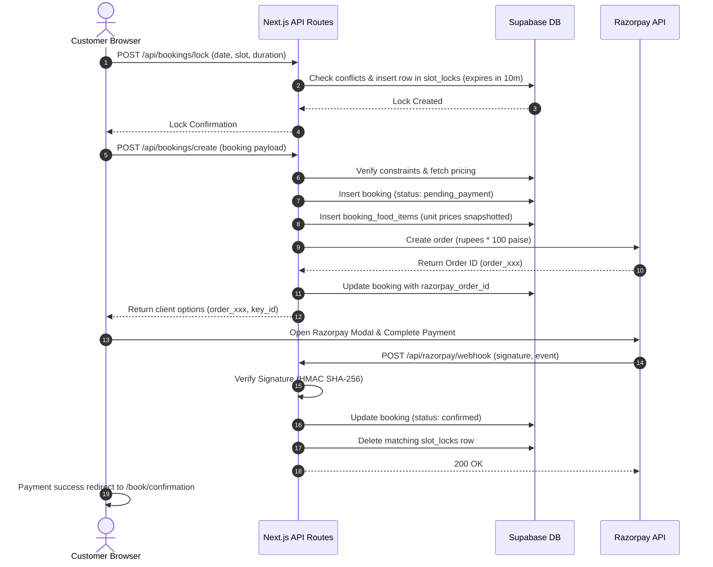

# Spec: Unit 9 — Room Booking Flow (Customer UI + API + Payment)

## Goal

Build the complete room booking workflow under `app/(customer)/book/` as an interactive multi-step checkout wizard secured by authentication middleware. Process upfront payments via Razorpay integration, manage database slot locks during checkout to prevent duplicate bookings, and provide confirmation feedback once the signature-verified webhook confirms the transaction.

---

## Design

### Client-Side Stepper Wizard UI
The page at `/book` will guide the user through a structured reservation flow. It is styled using the **Seoul Serenity** theme, featuring warm minimalism, cream backgrounds (`--color-background`), and deep espresso accents (`--color-primary`).

The wizard is divided into five interactive steps:
1. **Step 1: Space Selection**: 
   - Displays the Husk and Haven cards side-by-side using `--color-surface` and `--shadow-md`.
   - Displays the capacity and pricing constraints clearly.
   - Clicking a card updates the active booking state and transitions the user forward. Allows pre-selection using query params (e.g. `/book?room=husk`).
2. **Step 2: Date & Time Configuration**:
   - **Date Picker**: Custom-styled calendar input matching the input tokens in `ui-context.md`.
   - **Time Slots**: Dynamically fetches available times for the selected date and room from `/api/bookings/available-slots`. Renders them as clickable pill chips using `--radius-full`. Booked or blocked slots are rendered in a disabled greyed-out state (`--color-text-disabled`).
   - **Duration Slider**: A range slider (1 to 5 hours) matching the slider styling in `code.html`. Displays the end time dynamically (e.g. `2 Hours (Ends at 12:00 PM)`). Checks if the reservation extends past the 11:00 PM boundary and displays a validation warning if true.
3. **Step 3: Guests & Constraints**:
   - Counter input (plus/minus controls) for guest count with validation rules:
     - Husk: Maximum 2 guests.
     - Haven: Minimum 3, Maximum 8 guests.
   - Displays warnings dynamically using `--color-error` if the bounds are violated, disabling progression.
4. **Step 4: Optional Pre-order Menu**:
   - Renders the food and beverage items fetched from `menu_items` grouped by their category.
   - Allows users to add quantities to their order cart.
   - Updates the subtotal dynamically to provide instantaneous pricing feedback.
5. **Step 5: Reservation Review & Payment**:
   - Editorial summary pane displaying room details, date/time window, guest count, and itemized pre-ordered menu items.
   - Pricing ledger: Room rent subtotal, Food subtotal, 5% flat convenience fees, and Grand Total.
   - A prominent "Confirm & Pay" button that executes the API order creation and initiates the Razorpay checkout overlay.

### API & Payment Flow Architecture
- **`GET /api/bookings/available-slots`**: Accept query parameters `roomId` and `date`. Checks confirmed bookings, active slot locks, and manual admin blocks to return a JSON list of available hourly starts.
- **`POST /api/bookings/lock`**: Creates a temporary holding row in `slot_locks` for a duration window with a 10-minute expiration. Returns `409 Conflict` if the slot is taken or locked by another transaction in progress.
- **`POST /api/bookings/create`**: Calculates the checkout grand total on the server using database prices. Creates a pending booking row, links pre-ordered food items, generates a Razorpay Order ID via SDK, and returns it to the client.
- **`POST /api/razorpay/webhook`**: Receives payment callbacks from Razorpay. Verifies the signature using HMAC SHA-256 and updates the booking status to `'confirmed'`, clears the checkout lock, and completes the reservation.



---

## Implementation

### Folder Layout
Create the following files matching the system boundary design:

```
cove/
├── app/
│   ├── (customer)/
│   │   └── book/
│   │       ├── page.tsx                    # Booking stepper wizard
│   │       ├── page.css                    # Stepper wizard custom stylesheet
│   │       └── confirmation/
│   │           └── page.tsx                # Payment confirmation page
│   └── api/
│       ├── bookings/
│       │   ├── available-slots/
│       │   │   └── route.ts                # Available slots check endpoint
│       │   ├── lock/
│       │   │   └── route.ts                # Slot locking endpoint
│       │   └── create/
│       │       └── route.ts                # Order creation endpoint
│       └── razorpay/
│           └── webhook/
│               └── route.ts                # Razorpay checkout webhook
└── lib/
    └── razorpay/
        ├── orderCreator.ts                 # Razorpay SDK helper
        └── webhookVerifier.ts              # HMAC validation utility
```

---

### Webhook Verification — `lib/razorpay/webhookVerifier.ts`
Implement native Node crypto verification to prevent timing attacks.

```ts
import crypto from 'crypto';

/**
 * Validates a Razorpay webhook HMAC signature.
 * Uses timingSafeEqual to guard against timing vulnerabilities.
 */
export function verifyRazorpaySignature(
  rawBody: string,
  signature: string,
  secret: string
): boolean {
  const expectedSignature = crypto
    .createHmac('sha256', secret)
    .update(rawBody)
    .digest('hex');

  try {
    return crypto.timingSafeEqual(
      Buffer.from(signature, 'utf8'),
      Buffer.from(expectedSignature, 'utf8')
    );
  } catch {
    return false;
  }
}
```

---

### Razorpay Helper — `lib/razorpay/orderCreator.ts`
Implement standard wrapper logic using the Razorpay Node SDK.

```ts
import Razorpay from 'razorpay';

export function getRazorpayInstance(): Razorpay {
  if (!process.env.RAZORPAY_KEY_ID || !process.env.RAZORPAY_KEY_SECRET) {
    throw new Error('Razorpay credentials are not configured in environment variables.');
  }
  return new Razorpay({
    key_id: process.env.RAZORPAY_KEY_ID,
    key_secret: process.env.RAZORPAY_KEY_SECRET,
  });
}

/**
 * Creates an order in Razorpay.
 * Amount is converted from Rupees to Paise (multiplied by 100).
 */
export async function createRazorpayOrder(amountRupees: number, receiptId: string) {
  const razorpay = getRazorpayInstance();
  const options = {
    amount: Math.round(amountRupees * 100), // convert to paise
    currency: 'INR',
    receipt: receiptId,
  };
  return await razorpay.orders.create(options);
}
```

---

### Available Slots API — `app/api/bookings/available-slots/route.ts`
Returns the available starting hours (10:00 to 22:00) for a specific room and date.

```ts
import { NextRequest, NextResponse } from 'next/server';
import { createSupabaseServerClient } from '@/lib/supabase/serverClient';

export async function GET(req: NextRequest) {
  try {
    const { searchParams } = new URL(req.url);
    const roomId = searchParams.get('roomId');
    const date = searchParams.get('date');

    if (!roomId || !date) {
      return NextResponse.json({ error: 'Missing roomId or date parameter' }, { status: 400 });
    }

    const supabase = createSupabaseServerClient();

    // 1. Housekeeping: Remove expired slot locks
    await supabase
      .from('slot_locks')
      .delete()
      .lt('expires_at', new Date().toISOString());

    // 2. Fetch confirmed bookings
    const { data: bookings } = await supabase
      .from('bookings')
      .select('start_time, duration_hours')
      .eq('room_id', roomId)
      .eq('date', date)
      .eq('status', 'confirmed');

    // 3. Fetch active slot locks
    const { data: locks } = await supabase
      .from('slot_locks')
      .select('start_time, duration_hours')
      .eq('room_id', roomId)
      .eq('date', date);

    // 4. Fetch manual admin blocks
    const { data: blocks } = await supabase
      .from('blocked_slots')
      .select('start_time, duration_hours')
      .eq('room_id', roomId)
      .eq('date', date);

    // Operating hours range: 10:00 AM to 10:00 PM starting slot
    const allSlots = [
      '10:00', '11:00', '12:00', '13:00', '14:00', '15:00',
      '16:00', '17:00', '18:00', '19:00', '20:00', '21:00', '22:00'
    ];

    const unavailableSlots = new Set<string>();

    const checkOverlap = (start: string, duration: number) => {
      const startHour = parseInt(start.split(':')[0], 10);
      for (let i = 0; i < duration; i++) {
        unavailableSlots.add(`${startHour + i}:00`.padStart(5, '0'));
      }
    };

    bookings?.forEach(b => checkOverlap(b.start_time, b.duration_hours));
    locks?.forEach(l => checkOverlap(l.start_time, l.duration_hours));
    blocks?.forEach(bl => checkOverlap(bl.start_time, bl.duration_hours));

    const availableSlots = allSlots.filter(slot => !unavailableSlots.has(slot));

    return NextResponse.json({ data: { availableSlots } });
  } catch (err: any) {
    return NextResponse.json({ error: err.message || 'Server error' }, { status: 500 });
  }
}
```

---

### Slot Lock API — `app/api/bookings/lock/route.ts`
Enforces a 10-minute hold on a time slot during client payment operations.

```ts
import { NextRequest, NextResponse } from 'next/server';
import { createSupabaseServerClient } from '@/lib/supabase/serverClient';
import { checkSlotConflict } from '@/lib/booking/slotValidator';

export async function POST(req: NextRequest) {
  try {
    const supabase = createSupabaseServerClient();
    
    // Check session
    const { data: { session } } = await supabase.auth.getSession();
    if (!session) {
      return NextResponse.json({ error: 'Unauthorised' }, { status: 401 });
    }

    const body = await req.json();
    const { roomId, date, startTime, durationHours } = body;

    if (!roomId || !date || !startTime || !durationHours) {
      return NextResponse.json({ error: 'Missing required parameters' }, { status: 400 });
    }

    // Clean up expired locks first
    await supabase
      .from('slot_locks')
      .delete()
      .lt('expires_at', new Date().toISOString());

    // Validate slot availability
    const conflict = await checkSlotConflict(supabase, roomId, date, startTime, durationHours);
    if (conflict) {
      return NextResponse.json({ error: 'Time slot is no longer available' }, { status: 409 });
    }

    const expiresAt = new Date(Date.now() + 10 * 60 * 1000).toISOString(); // 10 minutes TTL

    const { data: lock, error: lockErr } = await supabase
      .from('slot_locks')
      .insert({
        room_id: roomId,
        date,
        start_time: startTime,
        duration_hours: durationHours,
        expires_at: expiresAt
      })
      .select()
      .single();

    if (lockErr || !lock) {
      return NextResponse.json({ error: 'Failed to acquire reservation lock' }, { status: 500 });
    }

    return NextResponse.json({
      data: {
        lockId: lock.id,
        expiresAt: lock.expires_at
      }
    });

  } catch (err: any) {
    return NextResponse.json({ error: err.message || 'Server error' }, { status: 500 });
  }
}
```

---

### Booking Order Creation API — `app/api/bookings/create/route.ts`
Authenticates checkout, checks rules, calculates prices server-side, seeds pending tables, and returns Razorpay initialization payloads.

```ts
import { NextRequest, NextResponse } from 'next/server';
import { createSupabaseServerClient } from '@/lib/supabase/serverClient';
import { createRazorpayOrder } from '@/lib/razorpay/orderCreator';
import { validateBookingBoundaries, validateGuestCount, checkSlotConflict } from '@/lib/booking/slotValidator';
import type { Room, MenuItem } from '@/lib/supabase/types';

export async function POST(req: NextRequest) {
  try {
    const supabase = createSupabaseServerClient();
    
    // Authenticate session
    const { data: { session } } = await supabase.auth.getSession();
    if (!session) {
      return NextResponse.json({ error: 'Unauthorised' }, { status: 401 });
    }

    const body = await req.json();
    const { roomId, date, startTime, durationHours, guestCount, foodItems } = body;

    // Boundary check
    if (!validateBookingBoundaries(startTime, durationHours)) {
      return NextResponse.json({ error: 'Boundary violations (duration out of range or past 11PM)' }, { status: 400 });
    }

    // Get room details
    const { data: room } = await supabase.from('rooms').select('*').eq('id', roomId).single();
    if (!room) {
      return NextResponse.json({ error: 'Room not found' }, { status: 404 });
    }

    const typedRoom = room as Room;

    // Capacity validation
    if (!validateGuestCount(typedRoom.slug, guestCount)) {
      return NextResponse.json({ error: 'Guest count violates room limits' }, { status: 400 });
    }

    // Double-booking check
    const isConflict = await checkSlotConflict(supabase, roomId, date, startTime, durationHours);
    if (isConflict) {
      return NextResponse.json({ error: 'Room slot is already booked' }, { status: 409 });
    }

    // Calculate Price Server-Side
    const roomRentTotal = typedRoom.price_per_hour * durationHours;
    let foodTotal = 0;
    const validatedFoodItems: Array<{ id: string; qty: number; price: number }> = [];

    if (foodItems && foodItems.length > 0) {
      const ids = foodItems.map((f: any) => f.id);
      const { data: dbFoodItems } = await supabase.from('menu_items').select('*').in('id', ids);

      if (dbFoodItems) {
        foodItems.forEach((f: any) => {
          const matchedDb = dbFoodItems.find((m: any) => m.id === f.id) as MenuItem;
          if (matchedDb && matchedDb.is_available) {
            foodTotal += matchedDb.price * f.qty;
            validatedFoodItems.push({ id: matchedDb.id, qty: f.qty, price: matchedDb.price });
          }
        });
      }
    }

    const subtotal = roomRentTotal + foodTotal;
    const convenienceFees = Math.round(subtotal * 0.05); // 5% flat convenience charge
    const grandTotal = subtotal + convenienceFees;

    // Database Transaction: Seed Booking and Food Items
    const { data: booking, error: bookingErr } = await supabase
      .from('bookings')
      .insert({
        user_id: session.user.id,
        room_id: roomId,
        date,
        start_time: startTime,
        duration_hours: durationHours,
        guest_count: guestCount,
        total_price: grandTotal,
        status: 'pending_payment'
      })
      .select()
      .single();

    if (bookingErr || !booking) {
      throw new Error(`Failed to create pending booking: ${bookingErr?.message}`);
    }

    // Snapshot pre-ordered food items immediately
    if (validatedFoodItems.length > 0) {
      const foodItemRows = validatedFoodItems.map(item => ({
        booking_id: booking.id,
        menu_item_id: item.id,
        quantity: item.qty,
        unit_price: item.price
      }));

      const { error: foodErr } = await supabase.from('booking_food_items').insert(foodItemRows);
      if (foodErr) {
        throw new Error(`Failed to save pre-order items: ${foodErr.message}`);
      }
    }

    // Create Razorpay checkout order
    const rpOrder = await createRazorpayOrder(grandTotal, booking.id);

    // Save Razorpay order ID to the pending booking
    const { error: updateErr } = await supabase
      .from('bookings')
      .update({ razorpay_order_id: rpOrder.id })
      .eq('id', booking.id);

    if (updateErr) {
      throw new Error(`Failed to update booking transaction parameters: ${updateErr.message}`);
    }

    return NextResponse.json({
      data: {
        bookingId: booking.id,
        razorpayOrderId: rpOrder.id,
        amount: rpOrder.amount,
        keyId: process.env.RAZORPAY_KEY_ID,
        customerName: session.user.user_metadata?.name || 'Customer',
        customerPhone: session.user.user_metadata?.phone || '',
        customerEmail: session.user.email || ''
      }
    });

  } catch (err: any) {
    return NextResponse.json({ error: err.message || 'Server error' }, { status: 500 });
  }
}
```

---

### Webhook API Endpoint — `app/api/razorpay/webhook/route.ts`
Process webhook callbacks using the Supabase Service-Role client to bypass RLS guards when confirming reservations.

```ts
import { NextRequest, NextResponse } from 'next/server';
import { createSupabaseServiceClient } from '@/lib/supabase/serverClient';
import { verifyRazorpaySignature } from '@/lib/razorpay/webhookVerifier';

export async function POST(req: NextRequest) {
  try {
    const rawBody = await req.text();
    const signature = req.headers.get('x-razorpay-signature') || '';
    const secret = process.env.RAZORPAY_WEBHOOK_SECRET;

    if (!secret) {
      return NextResponse.json({ error: 'Webhook secret is not configured' }, { status: 500 });
    }

    // 1. Signature check
    const isValid = verifyRazorpaySignature(rawBody, signature, secret);
    if (!isValid) {
      return NextResponse.json({ error: 'Signature validation failed' }, { status: 400 });
    }

    const payload = JSON.parse(rawBody);
    const event = payload.event;

    // 2. Handle Payment Capture Event
    if (event === 'payment.captured') {
      const rpOrderId = payload.payload.payment.entity.order_id;
      const supabase = createSupabaseServiceClient();

      // Retrieve matching pending booking
      const { data: booking, error: fetchErr } = await supabase
        .from('bookings')
        .select('*')
        .eq('razorpay_order_id', rpOrderId)
        .eq('status', 'pending_payment')
        .single();

      if (fetchErr || !booking) {
        return NextResponse.json({ error: 'Matching pending booking not found' }, { status: 404 });
      }

      // Confirm reservation
      const { error: updateErr } = await supabase
        .from('bookings')
        .update({ status: 'confirmed' })
        .eq('id', booking.id);

      if (updateErr) {
        throw new Error(`Failed to confirm booking: ${updateErr.message}`);
      }

      // Release active slot locks
      await supabase
        .from('slot_locks')
        .delete()
        .eq('room_id', booking.room_id)
        .eq('date', booking.date)
        .eq('start_time', booking.start_time);
    }

    return NextResponse.json({ received: true }, { status: 200 });
  } catch (err: any) {
    return NextResponse.json({ error: err.message || 'Webhook error' }, { status: 500 });
  }
}
```

---

### Stepper Wizard UI Structure — `app/(customer)/book/page.tsx`
Structure the wizard utilizing Next.js Client Component hooks to manage states.

- **Import custom fonts & styles**: Playfair Display + Inter via layout.
- **Wizard states**:
  - `activeStep`: `1 | 2 | 3 | 4 | 5`
  - `selectedRoom`: `Room | null`
  - `date`: `string`
  - `startTime`: `string`
  - `durationHours`: `number` (default 2)
  - `guestCount`: `number` (default 1)
  - `preOrderCart`: `Map<string, number>` (Item ID to quantity)
- **Time logic validations**:
  - Disable "Next" in Step 2 if `startTime` is empty or if `startTime + duration` exceeds 23:00 (11PM).
  - Show live alert banner below the range slider if the closing boundary is breached.
- **Guest validations**:
  - Check `guestCount` bounds based on `selectedRoom.slug` and show descriptive error state inline if incorrect.
- **Payment processing flow**:
  - Trigger `POST /api/bookings/lock` to acquire hold.
  - On failure, show inline error alerting that the slot was locked or taken.
  - If lock succeeds, call `POST /api/bookings/create` to retrieve Razorpay payloads.
  - Initialize the inline Razorpay SDK configuration using `window.Razorpay`.
  - Open Razorpay popup modal. Set `handler` callback to redirect the customer to `/book/confirmation?bookingId=[id]`.

---

## Dependencies

Install the official Razorpay SDK:

```bash
npm install razorpay
```

Install type definitions for the SDK (if available or declare module fallback in types declarations).

---

## Verification Checklist

### Client Stepper Flow
- [ ] Route is protected; visiting `/book` redirects unauthenticated sessions to `/login`.
- [ ] Direct linking via `/book?room=husk` or `/book?room=haven` pre-selects the corresponding room.
- [ ] Date input rejects historical days.
- [ ] Selecting a date triggers available-slots load, rendering free times as selectable pill chips and disabling booked slots.
- [ ] Slide control updates duration inline, calculating ending time (e.g. `12:00 PM to 03:00 PM`).
- [ ] Exceeding the 11:00 PM close limit shows a distinct validation warning and prevents proceeding.
- [ ] Guest counts evaluate boundaries client-side, showing errors immediately.
- [ ] Accordion menu fetches active menu items and supports real-time additions/deletions.
- [ ] Summary step lists all variables and calculates calculations accurately matching database values.

### API & Transaction Safety
- [ ] available-slots returns only vacant times, excluding confirmed bookings, locks, and manual blocks.
- [ ] slot-lock endpoint successfully inserts a hold with a 10-minute expiration.
- [ ] Requesting a lock on an overlapping occupied block returns a `409 Conflict`.
- [ ] Booking creation computes all prices server-side by checking database values.
- [ ] Booking creation writes pending rows in both `bookings` and `booking_food_items` with unit prices snapshotted.

### Razorpay & Webhooks
- [ ] Checkout creates a valid order using Razorpay SDK, converting amounts to Paise.
- [ ] Webhook verify utility validates authentic Razorpay signatures and blocks modified payloads.
- [ ] Webhook callback changes database booking status to `confirmed` and clears slot locks.
- [ ] Security validation: Razorpay secret keys are protected, server-only environment variables.
